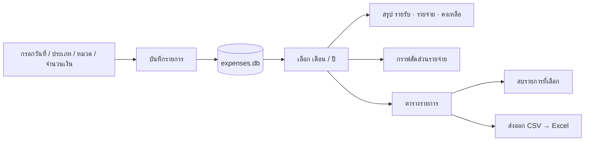
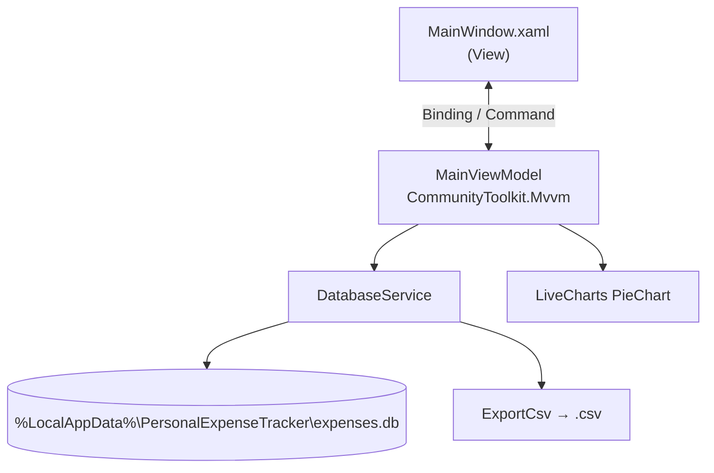

# 💰 Personal Expense Tracker

[](https://github.com/adisorn6302565/Personal-Expense-Tracker---/actions/workflows/build.yml)


โปรแกรมบันทึกรายรับ-รายจ่ายส่วนตัว (WPF) ดูสรุปรายเดือน กราฟวงกลมสัดส่วนรายจ่าย และส่งออกเป็น CSV เปิดใน Excel ได้ ข้อมูลเก็บในเครื่อง (SQLite) ไม่ส่งออกอินเทอร์เน็ต

---

## 📥 ติดตั้ง

**ไม่ต้องติดตั้ง และไม่ต้องลง .NET** เป็น EXE ไฟล์เดียว

1. ดาวน์โหลด **`PersonalExpenseTracker.exe`** จาก [**Releases ล่าสุด**](../../releases/latest)
2. ดับเบิลคลิกเปิดได้เลย
   - ถ้า SmartScreen เตือน: **More info → Run anyway** (ไฟล์ยังไม่ได้ sign)

ข้อมูลเก็บที่ `%LocalAppData%\PersonalExpenseTracker\expenses.db`
- **สำรองข้อมูล:** คัดลอกไฟล์นี้เก็บไว้
- **ย้ายเครื่อง:** วางไฟล์นี้ที่ตำแหน่งเดียวกันในเครื่องใหม่

**ถอนการติดตั้ง:** ลบไฟล์ EXE (ถ้าต้องการลบข้อมูลด้วย ให้ลบโฟลเดอร์ข้างบน)

---

## 🚀 วิธีใช้



1. ฝั่งซ้าย: เลือกวันที่ ประเภท (รายรับ/รายจ่าย) หมวดหมู่ กรอกจำนวนเงิน → **บันทึกรายการ**
2. ฝั่งขวาบน: เลือก **เดือน / ปี** ที่ต้องการดู (ปีในรายการมาจากข้อมูลจริงทั้งหมด)
3. **ส่งออก CSV**: บันทึกรายการของเดือนที่เลือกเป็นไฟล์ `.csv` (UTF-8 เปิดใน Excel แล้วภาษาไทยไม่เพี้ยน)
4. เลือกแถวในตาราง แล้วกด **ลบรายการที่เลือก** เพื่อลบ

---

## 🧩 โครงสร้าง



```text
├── MainWindow.xaml(.cs)     # UI
├── MainViewModel.cs         # logic: add / delete / filter / export
├── DatabaseService.cs       # SQLite + CSV
├── ExpenseModel.cs          # Transaction model
├── PersonalExpenseTracker.csproj
├── build.bat
└── .github/workflows/build.yml
```

---

## 🛠️ Build เอง

ต้องมี [.NET 8 SDK](https://dotnet.microsoft.com/download/dotnet/8.0)

- ดับเบิลคลิก **`build.bat`** → ได้ `publish\PersonalExpenseTracker.exe`
- หรือ: `dotnet publish PersonalExpenseTracker.csproj -c Release -o publish`
- รันแบบ dev: `dotnet run`

**ออก Release:** `git tag v1.1.0 && git push origin v1.1.0` → GitHub Actions จะ build แล้วแนบ EXE ในหน้า Releases

---

## 🆕 v1.1

| เดิม | ใหม่ |
|---|---|
| `expenses.db` สร้างตามโฟลเดอร์ที่เปิดโปรแกรม เปิดจากที่อื่นแล้ว **ข้อมูลหาย** | เก็บใน `%LocalAppData%` ที่เดียว และย้ายไฟล์เก่าให้อัตโนมัติ |
| เครื่องที่ตั้งภาษาไทยบันทึกปีเป็น พ.ศ. (2568) → ตัวกรองเดือน/ปีไม่เจอข้อมูล | บันทึกวันที่แบบ invariant และแก้ข้อมูลเก่าที่เป็น พ.ศ. ตอนอ่าน |
| ปีให้เลือกแค่ 6 ปีล่าสุด | สร้างจากปีที่มีข้อมูลจริง |
| ไม่มีการส่งออก | ปุ่ม **ส่งออก CSV** |
| build ไม่ผ่าน (CS0102 ของ MVVM generator ซ้ำ) | แก้ใน csproj + CommunityToolkit.Mvvm 8.4 |
| zip ที่ build แล้วอยู่ใน git | EXE ไฟล์เดียวใน GitHub Releases (build อัตโนมัติ) |
